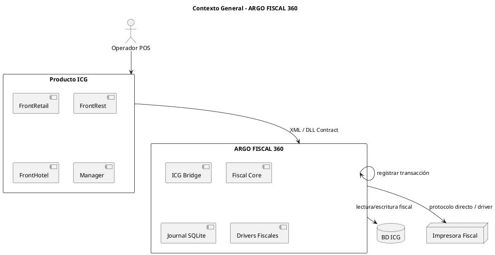

# ARGO FISCAL PRINTER 360 – Visión del Sistema

**Código:** ARGO-FISCAL-PRINTER-360  
**Versión:** 1.0  
**Estado:** Borrador  

---

## 1. Propósito

Definir la visión general de **ARGO FISCAL 360**, estableciendo su alcance, objetivos, contexto operativo y relación con sistemas externos, especialmente los productos POS de ICG en el mercado venezolano.

---

## 2. Alcance

ARGO FISCAL 360 es una plataforma de integración fiscal diseñada exclusivamente para sistemas POS de ICG (FrontRetail, FrontRest, FrontHotel y Manager), que permite la comunicación confiable con múltiples impresoras fiscales utilizadas en Venezuela.

El sistema garantiza:

- Cumplimiento de normativa fiscal venezolana (SENIAT)
- Manejo correcto del IGTF
- Trazabilidad completa de las transacciones fiscales
- Independencia de DLLs de fabricantes mediante protocolos directos
- Recuperación de información fiscal ante fallos

---

## 3. Definición del Sistema

ARGO FISCAL 360 actúa como una capa intermedia entre:

```bash
POS ICG → ARGO FISCAL 360 → Impresora Fiscal
```

Procesando:

- XML generados por ICG
- Datos fiscales almacenados en la BD del POS
- Comandos fiscales hacia la impresora

---

## 4. Objetivos del Sistema

- **OBJ-001:** Garantizar compatibilidad total con productos ICG  
- **OBJ-002:** Asegurar cumplimiento fiscal en Venezuela  
- **OBJ-003:** Proveer trazabilidad completa de operaciones  
- **OBJ-004:** Permitir integración con múltiples fabricantes  
- **OBJ-005:** Eliminar dependencia obligatoria de DLLs externas  
- **OBJ-006:** Facilitar auditoría y recuperación de datos fiscales  

---

## 5. Stakeholders

- Usuarios POS (operadores de caja)  
- Empresas usuarias de sistemas ICG  
- ARGO SISTEMAS (desarrollo y soporte)  
- ICG (proveedor del POS)  
- SENIAT (ente regulador)  
- Fabricantes de impresoras fiscales (HKA, PNP, VMAX, ISC, etc.)  

---

## 6. Supuestos

- Cada POS está asociado a una única impresora fiscal  
- El POS ICG genera XML conforme a su estándar  
- Existe acceso a la base de datos del POS/Manager  
- Las impresoras fiscales cumplen normativa vigente  

---

## 7. Restricciones

- Uso exclusivo con productos ICG  
- Operación en entorno Windows 10/11  
- Cumplimiento obligatorio de normativa SENIAT  
- No se permite compartir impresoras entre POS  

---

## 8. Contexto del Sistema



---

## 9. Características Clave

- Integración nativa con ICG
- Soporte multi-fabricante
- Comunicación directa por protocolo
- Journal transaccional (SQLite)
- Persistencia de expedientes fiscales
- Mecanismos de recuperación de datos
- Manejo de IGTF

---

## 10. Definiciones

- **IGTF:** Impuesto a Grandes Transacciones Financieras
- **POS:** Punto de Venta
- **DLL:** Librería dinámica
- **Journal:** Registro transaccional persistente
- **Campos libres:** Campos configurables en BD ICG

---

## 11. Criterios de éxito

- 100% compatibilidad con flujos ICG
- 0 pérdida de información fiscal
- Capacidad de reconstrucción de transacciones
- Operación estable en entorno productivo

---

## 12. Estado del documento

Borrador inicial – sujeto a validación
