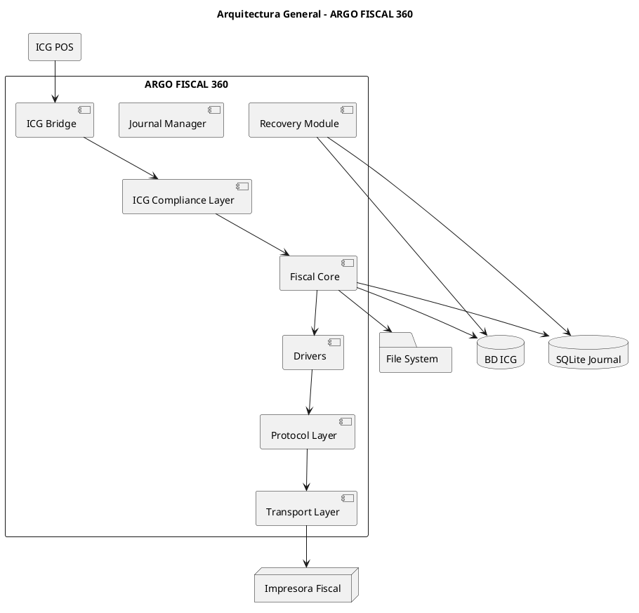
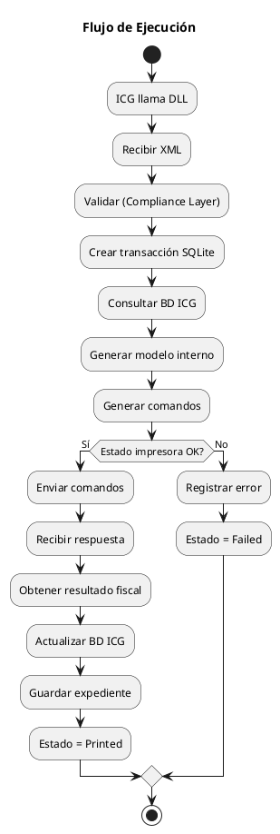
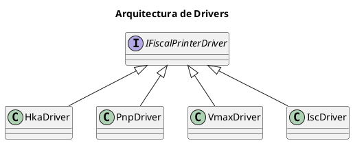
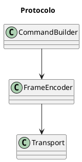

# ARGO FISCAL PRINTER 360 – Arquitectura del Sistema

**Código:** ARGO-FISCAL-PRINTER-360  
**Documento:** Arquitectura del Sistema  
**Versión:** 1.0  
**Estado:** Borrador  

---

## 1. Propósito

Definir la arquitectura de ARGO FISCAL 360, describiendo su estructura modular, capas, responsabilidades y flujo de ejecución para garantizar cumplimiento fiscal, trazabilidad y extensibilidad.

---

## 2. Principios de Arquitectura

- Separación de responsabilidades
- Aislamiento por capas
- Independencia de fabricantes
- Trazabilidad total
- Robustez ante fallos
- Compatibilidad estricta con ICG

---

## 3. Vista General



---

## 4. Capas del Sistema

### 4.1 ICG Bridge

Responsable de:

- Exponer funciones DLL esperadas por ICG
- Recibir XML
- Manejar contrato de entrada/salida

---

### 4.2 ICG Compliance Layer

- Normalización Retail/Rest/Hotel/Manager
- Validación estricta de XML
- Adaptación de flujos

---

### 4.3 Fiscal Core

- Orquestación de la operación
- Validación de negocio
- Generación de comandos fiscales
- Coordinación con BD ICG
- Coordinación con drivers

Es el **corazón del sistema**.

---

### 4.4 Journal Manager

- Persistencia en SQLite
- Manejo de estados de transacción
- Generación de hash
- Registro de eventos

---

### 4.5 Recovery Module

- Detección de inconsistencias
- Reconstrucción de datos fiscales
- Reaplicación a BD ICG

---

### 4.6 Drivers

- Implementación por fabricante
- Conversión de documento → comandos

Ejemplos:

- Driver.HKA
- Driver.PNP
- Driver.VMAX
- Driver.ISC

---

### 4.7 Protocol Layer

- Construcción de tramas
- Codificación de comandos
- Manejo de checksum/LRC

---

### 4.8 Transport Layer

- Serial (COM)
- USB (COM virtual)
- TCP/IP

---

## 5. Flujo de Ejecución



---

## 6. Arquitectura de Drivers



---

## 7. Arquitectura de Protocolo



---

## 8. Gestión de Estado

Cada transacción pasa por:

```text
Created → Validated → CommandsGenerated → Printing → Printed
                               ↓
                            Failed
                               ↓
                        RecoveryRequired
                               ↓
                            Recovered
```

---

## 9. Estrategia de Integración

- Fase 1: Compatibilidad total con DLL existente
- Fase 2: Implementación de drivers directos
- Fase 3: Eliminación de dependencias externas

---

## 10. Escalabilidad

- 1 instancia por POS
- Aislamiento total por carpeta
- No compartición de impresoras

---

## 11. Estado del documento

Borrador inicial – sujeto a validación
