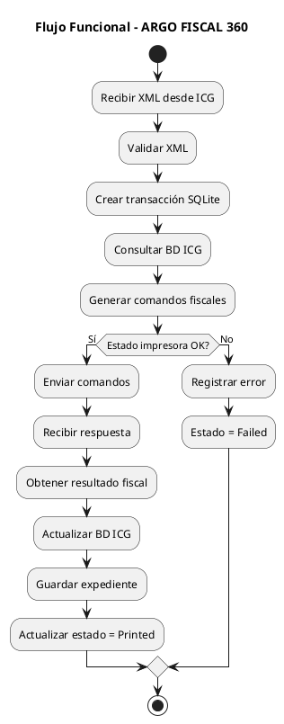

# ARGO FISCAL PRINTER 360 – Requisitos Funcionales

**Código:** ARGO-FISCAL-PRINTER-360  
**Documento:** Requisitos Funcionales  
**Versión:** 1.0  
**Estado:** Borrador  

---

## 1. Propósito

Definir los requisitos funcionales de ARGO FISCAL PRINTER 360, describiendo el comportamiento esperado del sistema en la integración con productos ICG y la ejecución de operaciones fiscales en impresoras certificadas en Venezuela.

---

## 2. Clasificación de Requisitos

- RF-ICG     → Integración con POS ICG
- RF-DOC     → Procesamiento de documentos fiscales
- RF-PRN     → Interacción con impresoras
- RF-DB      → Integración con BD ICG
- RF-JRN     → Journal y trazabilidad
- RF-REC     → Recuperación
- RF-CFG     → Configuración

---

## 3. Requisitos de Integración ICG

### RF-ICG-001 – Recepción de solicitudes

El sistema deberá recibir solicitudes desde productos ICG mediante funciones DLL estándar.

---

### RF-ICG-002 – Procesamiento de XML

El sistema deberá procesar los siguientes XML:

- pCab.xml
- pLineas.xml
- pCliente.xml
- pFormasPago.xml
- pExportInfo.xml

---

### RF-ICG-003 – Compatibilidad multi-producto

El sistema deberá soportar:

- FrontRetail
- FrontRest
- FrontHotel
- Manager

---

### RF-ICG-004 – Validación de entrada

El sistema deberá validar estructura, consistencia y completitud de los XML antes de procesar.

---

## 4. Requisitos de Documentos Fiscales

### RF-DOC-001 – Generación de factura

El sistema deberá generar e imprimir documentos fiscales tipo factura.

---

### RF-DOC-002 – Notas de crédito

El sistema deberá procesar notas de crédito, incluyendo búsqueda de factura afectada.

---

### RF-DOC-003 – Notas de débito

El sistema deberá procesar notas de débito cuando aplique.

---

### RF-DOC-004 – Documentos no fiscales

El sistema deberá soportar impresión de documentos no fiscales.

---

### RF-DOC-005 – Manejo de pagos

El sistema deberá procesar múltiples formas de pago, incluyendo divisas.

---

### RF-DOC-006 – Manejo de IGTF

El sistema deberá calcular y aplicar IGTF según normativa vigente.

---

### RF-DOC-007 – Validación de estado fiscal

El sistema deberá validar el estado de la impresora antes de cualquier operación.

---

## 5. Requisitos de Impresoras Fiscales

### RF-PRN-001 – Comunicación directa

El sistema deberá comunicarse con impresoras mediante protocolo directo.

---

### RF-PRN-002 – Soporte multi-fabricante

El sistema deberá soportar múltiples fabricantes:

- HKA
- PNP
- VMAX
- ISC

---

### RF-PRN-003 – Manejo de errores

El sistema deberá detectar y manejar errores de impresión.

---

### RF-PRN-004 – Secuencialidad

El sistema deberá ejecutar comandos de forma secuencial.

---

### RF-PRN-005 – Confirmación fiscal

El sistema deberá obtener y validar el resultado fiscal de la impresora.

---

## 6. Requisitos de Base de Datos ICG

### RF-DB-001 – Lectura de datos

El sistema deberá leer datos desde la BD ICG para completar información fiscal.

---

### RF-DB-002 – Escritura de campos fiscales

El sistema deberá actualizar campos libres en la BD ICG después de imprimir.

---

### RF-DB-003 – Manejo de NC/ND

El sistema deberá consultar documentos afectados en la BD ICG.

---

### RF-DB-004 – Persistencia de IGTF

El sistema deberá guardar datos IGTF en la BD ICG.

---

## 7. Requisitos de Journal

### RF-JRN-001 – Registro de transacciones

El sistema deberá registrar todas las transacciones en SQLite.

---

### RF-JRN-002 – Persistencia de expedientes

El sistema deberá almacenar todos los archivos asociados a la transacción.

---

### RF-JRN-003 – Trazabilidad completa

El sistema deberá permitir reconstruir cualquier operación fiscal.

---

### RF-JRN-004 – Integridad

El sistema deberá generar hash de integridad por transacción.

---

## 8. Requisitos de Recuperación

### RF-REC-001 – Detección de inconsistencias

El sistema deberá detectar documentos sin información fiscal en BD ICG.

---

### RF-REC-002 – Reconstrucción de datos

El sistema deberá reconstruir datos fiscales desde el journal.

---

### RF-REC-003 – Reaplicación

El sistema deberá permitir reinsertar datos fiscales en la BD ICG.

---

### RF-REC-004 – Registro de recuperación

El sistema deberá registrar todas las operaciones de recuperación.

---

## 9. Requisitos de Configuración

### RF-CFG-001 – Configuración por POS

El sistema deberá manejar configuración independiente por POS.

---

### RF-CFG-002 – Configuración de impresora

El sistema deberá permitir configurar puerto, modelo y driver.

---

### RF-CFG-003 – Configuración de BD

El sistema deberá permitir configurar conexión a BD ICG.

---

### RF-CFG-004 – Configuración de rutas

El sistema deberá permitir definir rutas de almacenamiento.

---

## 10. Flujo Funcional General

---

## 11. Estado del documento

Borrador inicial – sujeto a validación
