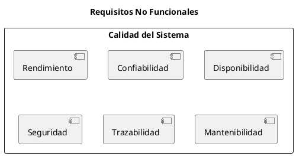

# ARGO FISCAL PRINTER 360 – Requisitos No Funcionales

**Código:** ARGO-FISCAL-PRINTER-360  
**Documento:** Requisitos No Funcionales  
**Versión:** 1.0  
**Estado:** Borrador  

---

## 1. Propósito

Definir los requisitos no funcionales de ARGO FISCAL PRINTER 360, estableciendo criterios de rendimiento, confiabilidad, seguridad, disponibilidad y mantenibilidad necesarios para operar en entornos fiscales reales en Venezuela.

---

## 2. Clasificación

- RNF-PERF → Rendimiento
- RNF-REL  → Confiabilidad
- RNF-AVL  → Disponibilidad
- RNF-SEC  → Seguridad
- RNF-LOG  → Trazabilidad
- RNF-MNT  → Mantenibilidad
- RNF-COMP → Compatibilidad
- RNF-DEP  → Despliegue

---

## 3. Rendimiento

### RNF-PERF-001 – Tiempo de respuesta

El sistema deberá procesar una operación fiscal en menos de:

```bash
< 500 ms (sin impresión)
< 5 segundos (con impresión)
```

---

### RNF-PERF-002 – Procesamiento secuencial

El sistema deberá procesar transacciones de forma secuencial sin degradación de rendimiento.

---

## 4. Confiabilidad

### RNF-REL-001 – Integridad de datos

El sistema no deberá perder información fiscal bajo ninguna circunstancia.

---

### RNF-REL-002 – Recuperación ante fallos

El sistema deberá poder recuperar transacciones interrumpidas.

---

### RNF-REL-003 – Consistencia

Los datos en SQLite, archivos y BD ICG deben mantenerse consistentes.

---

## 5. Disponibilidad

### RNF-AVL-001 – Operación continua

El sistema deberá operar de forma continua durante jornadas completas sin reinicio.

---

### RNF-AVL-002 – Tolerancia a fallos

El sistema deberá continuar operando ante:

- fallos de impresora
- desconexión temporal
- errores de comunicación

---

## 6. Seguridad

### RNF-SEC-001 – Acceso controlado

El sistema deberá restringir acceso a configuración y recuperación.

---

### RNF-SEC-002 – Integridad de archivos

Los expedientes fiscales no deberán ser modificables sin registro.

---

### RNF-SEC-003 – Auditoría

Toda operación crítica deberá quedar registrada.

---

## 7. Trazabilidad

### RNF-LOG-001 – Registro completo

Cada transacción deberá registrar:

- XML de entrada
- comandos enviados
- respuestas
- resultado fiscal
- errores

---

### RNF-LOG-002 – Persistencia

Los registros no deberán eliminarse automáticamente.

---

## 8. Mantenibilidad

### RNF-MNT-001 – Modularidad

El sistema deberá estar dividido en módulos independientes:

- Core
- Drivers
- Protocol
- Transport
- ICG Bridge
- Recovery

---

### RNF-MNT-002 – Extensibilidad

El sistema deberá permitir agregar nuevos fabricantes sin afectar los existentes.

---

## 9. Compatibilidad

### RNF-COMP-001 – Sistemas ICG

Compatibilidad obligatoria con:

- FrontRetail
- FrontRest
- FrontHotel
- Manager

---

### RNF-COMP-002 – Sistemas Operativos

- Windows 10
- Windows 11

---

## 10. Despliegue

### RNF-DEP-001 – Instalación local

El sistema deberá instalarse localmente en cada POS.

---

### RNF-DEP-002 – Estructura de datos

Los datos deberán almacenarse en:

```bash
C:\ProgramData\ARGO\Fiscal360\POSXX\
```

---

### RNF-DEP-003 – Independencia

El sistema no deberá depender de servicios externos para operar.

---

## 11. Escalabilidad

### RNF-ESC-001 – Multi-POS

El sistema deberá permitir múltiples instancias independientes (una por POS).

---

## 12. Robustez

### RNF-RBT-001 – Validación estricta

El sistema deberá validar todos los datos antes de ejecutar operaciones.

---

### RNF-RBT-002 – Manejo de errores

Todos los errores deberán ser capturados y gestionados.

---

## 13. Diagrama de Calidad



---

## 14. Estado del documento

Borrador inicial – sujeto a validación
