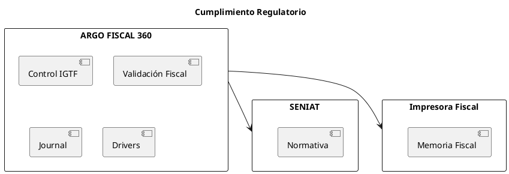

# ARGO FISCAL PRINTER 360 – Requisitos Regulatorios (Venezuela)

**Código:** ARGO-FISCAL-PRINTER-360  
**Documento:** Requisitos Regulatorios  
**Versión:** 1.0  
**Estado:** Borrador  

---

## 1. Propósito

Definir los requisitos regulatorios que ARGO FISCAL PRINTER 360 debe cumplir para operar conforme a la normativa fiscal vigente en Venezuela, incluyendo disposiciones del SENIAT y manejo del IGTF.

---

## 2. Alcance

Este documento aplica a todas las operaciones fiscales realizadas por ARGO FISCAL 360 en integración con productos ICG y dispositivos fiscales autorizados.

---

## 3. Marco Regulatorio

- SENIAT (Servicio Nacional Integrado de Administración Aduanera y Tributaria)
- Normativa de máquinas fiscales vigente
- Ley del IGTF (Impuesto a Grandes Transacciones Financieras)

---

## 4. Requisitos Generales

### REG-001 – Uso de impresoras fiscales autorizadas

El sistema deberá operar exclusivamente con impresoras fiscales autorizadas por el SENIAT.

---

### REG-002 – Integridad de documentos fiscales

El sistema no deberá alterar información fiscal generada por la impresora.

---

### REG-003 – Emisión controlada

El sistema deberá impedir la emisión de documentos fiscales si la impresora no está en estado válido.

---

### REG-004 – Relación POS–Impresora

El sistema deberá garantizar una relación uno a uno entre POS e impresora fiscal.

---

## 5. Requisitos IGTF

### REG-IGTF-001 – Aplicación de IGTF

El sistema deberá calcular y aplicar IGTF cuando existan pagos en divisas o equivalentes.

---

### REG-IGTF-002 – Medios de pago

El sistema deberá reconocer medios de pago asociados a IGTF (ej: códigos 20–24 según fabricante).

---

### REG-IGTF-003 – Activación por flag

El sistema deberá respetar la configuración de activación de IGTF en la impresora (ej: flag 50).

---

### REG-IGTF-004 – Comando de cierre

El sistema deberá ejecutar comandos fiscales requeridos para IGTF (ej: comando 199 en HKA).

---

### REG-IGTF-005 – Registro en BD

El sistema deberá persistir BASEIGTF y TOTALIGTF en la BD del POS.

---

## 6. Requisitos de Trazabilidad

### REG-TRZ-001 – Registro obligatorio

Toda transacción fiscal deberá ser registrada completamente.

---

### REG-TRZ-002 – Evidencia

El sistema deberá conservar evidencia suficiente para reconstruir cualquier operación fiscal.

---

### REG-TRZ-003 – Auditoría

El sistema deberá permitir auditoría de operaciones fiscales.

---

## 7. Requisitos de Estado Fiscal

### REG-EST-001 – Validación previa

El sistema deberá validar estado de impresora antes de cada operación.

---

### REG-EST-002 – Manejo de errores fiscales

El sistema deberá manejar correctamente errores fiscales reportados por la impresora.

---

## 8. Requisitos de Base de Datos ICG

### REG-DB-001 – Persistencia fiscal

El sistema deberá almacenar en la BD ICG:

- Número fiscal
- Número de control
- Serial de impresora
- ZFiscal
- Fecha fiscal
- Datos IGTF

---

### REG-DB-002 – Factura afectada

El sistema deberá registrar correctamente la factura afectada en notas de crédito y débito.

---

## 9. Requisitos de Recuperación

### REG-REC-001 – Reconstrucción

El sistema deberá permitir reconstruir información fiscal faltante.

---

### REG-REC-002 – Corrección auditada

Toda corrección deberá quedar registrada.

---

## 10. Restricciones Legales

- No se permite modificar documentos fiscales emitidos
- No se permite compartir impresoras entre POS
- No se permite operación sin impresora fiscal activa

---

## 11. Diagrama de Cumplimiento

---

## 12. Estado del documento

Borrador inicial – sujeto a validación
