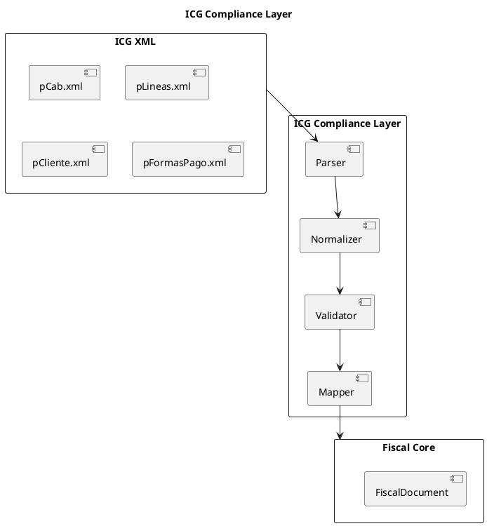
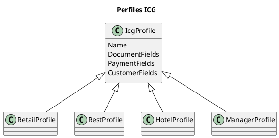

# ARGO FISCAL PRINTER 360 – ICG Compliance Layer

**Código:** ARGO-FISCAL-PRINTER-360  
**Documento:** ICG Compliance Layer  
**Versión:** 1.0  
**Estado:** Borrador  

---

## 1. Propósito

Definir el diseño del **ICG Compliance Layer**, responsable de garantizar que ARGO FISCAL PRINTER 360 sea 100% compatible con los productos ICG, independientemente de las variaciones en XML, base de datos y comportamiento esperado.

---

## 2. Problema a Resolver

Los productos ICG presentan diferencias en:

- Estructura de XML (Retail vs Rest vs Hotel vs Manager)
- Campos utilizados
- Lógica de negocio implícita
- Manejo de base de datos
- Casos edge no documentados

El Compliance Layer elimina estas diferencias para el Core.

---

## 3. Objetivo

Normalizar todas las entradas ICG en un modelo único, consistente y validado.

---

## 4. Arquitectura

---

## 5. Componentes

### 5.1 Parser

Responsable de:

- Leer XML
- Convertir a estructuras intermedias
- Manejar encoding y formatos

---

### 5.2 Normalizer

- Unificar diferencias entre Retail/Rest/Hotel/Manager
- Mapear nombres de campos
- Ajustar estructuras inconsistentes

Ejemplo:

- SERIE vs SERIEFAC
- NUMERO vs NUMFACTURA

---

### 5.3 Validator

- Validar campos obligatorios
- Validar consistencia de totales
- Validar pagos vs total
- Validar reglas fiscales

---

### 5.4 Mapper

- Convertir a modelo interno (FiscalDocument)
- Preparar datos para el Core

---

## 6. Perfiles ICG

---

## 9. Reglas de Validación

- Total = suma de líneas
- Pagos = total documento
- Cliente válido (según tipo)
- IGTF consistente con pagos
- Documento afectado válido en NC

---

## 10. Manejo de Errores

- XML inválido → rechazar
- Datos inconsistentes → error controlado
- Campos faltantes → completar si es posible

---

## 11. Estrategia de Compatibilidad

- Reproducir comportamiento VB6 existente
- No “mejorar” lógica sin validar impacto
- Priorizar compatibilidad sobre elegancia

---

## 12. Casos Edge

- Cliente vacío
- Pagos parciales
- IGTF parcial
- NC sin referencia completa
- Campos libres mal configurados

---

## 13. Reglas Clave

- El Core nunca ve XML directo
- Todo pasa por Compliance Layer
- No se permite bypass

---

## 14. Estado del documento

Borrador inicial – sujeto a validación
