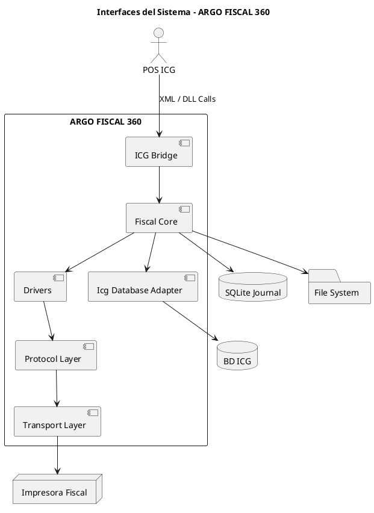

# ARGO FISCAL PRINTER 360 – Interfaces del Sistema

**Código:** ARGO-FISCAL-PRINTER-360  
**Documento:** Interfaces del Sistema  
**Versión:** 1.0  
**Estado:** Borrador  

---

## 1. Propósito

Definir todas las interfaces externas e internas de ARGO FISCAL PRINTER 360, incluyendo la interacción con sistemas POS ICG, bases de datos, impresoras fiscales y componentes internos.

---

## 2. Visión General de Interfaces

ARGO FISCAL PRINTER 360 interactúa con los siguientes sistemas:

- POS ICG (FrontRetail, FrontRest, FrontHotel, Manager)
- Base de datos ICG
- Impresoras fiscales
- Sistema de archivos local
- Journal SQLite

---

## 3. Diagrama General de Interfaces



---

## 4. Interfaz con POS ICG

### 4.1 Tipo

DLL Contract (API de funciones exportadas)

### 4.2 Funciones principales

- Iniciar
- Finalizar
- Venta
- ReporteX
- ReporteZ
- Configurar
- CashIn
- CashOut
- DocNoFiscal
- Reset
- ExportInfo
- ImprimirVoucher

### 4.3 Entrada de datos

Archivos XML:

- pCab.xml
- pLineas.xml
- pCliente.xml
- pFormasPago.xml
- pExportInfo.xml

### 4.4 Reglas

- Debe respetarse el contrato exacto esperado por ICG
- Los XML pueden variar según producto (Retail, Rest, Hotel, Manager)
- La validación es obligatoria antes de procesar

---

## 5. Interfaz con Base de Datos ICG

### 5.1 Tipo

Conexión SQL Server (ADO / ODBC)

### 5.2 Operaciones

Lectura:

- Datos de documentos
- Facturas afectadas (NC/ND)
- Configuración

Escritura:

- Campos libres fiscales
- Número fiscal
- Número de control
- Serial de impresora
- Datos IGTF

### 5.3 Tablas relevantes

- FACTURASVENTA
- FACTURASVENTACAMPOSLIBRES
- TIQUETSCAB
- TIQUETSVENTACAMPOSLIBRES

### 5.4 Reglas

- Escritura solo después de confirmación fiscal
- Validación previa obligatoria
- Manejo diferenciado por tipo de ICG

---

## 6. Interfaz con Impresoras Fiscales

### 6.1 Tipo

Comunicación directa por protocolo propietario

### 6.2 Métodos

- Serial (RS232)
- USB (emulación COM)
- TCP/IP (si aplica)

### 6.3 Componentes

- Transport Layer
- Protocol Layer
- Driver por fabricante

### 6.4 Fabricantes soportados

HKA
PNP
VMAX
ISC

### 6.5 Reglas

- Comunicación secuencial (no concurrente)
- Manejo de ACK/NAK
- Validación de estado antes de cada operación
- Manejo de errores obligatorio

---

## 7. Interfaz con Sistema de Archivos

### 7.1 Ubicación

```bash
C:\ProgramData\ARGO\Fiscal360\POSXX\
```

### 7.2 Contenido

```bash
/transactions/
  expediente fiscal completo

/logs/
  logs de ejecución

/config.json
  configuración del sistema
```

### 7.3 Reglas

- No usar rutas relativas
- Separación por POS
- Persistencia obligatoria

---

## 8. Interfaz SQLite (Journal)

### 8.1 Tipo

Base de datos local SQLite

### 8.2 Función

Registro transaccional fiscal

### 8.3 Datos almacenados

```text
- Identificación de documento
- Estado de transacción
- Resultado fiscal
- Rutas de expediente
- Hash de integridad
- Errores
```

### 8.4 Reglas

- Escritura antes, durante y después de la operación
- Nunca eliminar registros automáticamente
- Soporte para recuperación

---

## 9. Interfaz Interna (Componentes)

- ICG Bridge
- Icg Database Adapter
- Fiscal Core
- Drivers
- Protocol Layer
- Transport Layer
- Recovery Module
- Journal Manager

---

## 10. Reglas Generales de Interfaz

- Todas las interfaces deben ser tolerantes a fallos
- Toda operación debe ser trazable
- No se permite pérdida de información
- Validación obligatoria en cada capa
- Separación clara de responsabilidades

---

## 11. Estado del documento

Borrador inicial – sujeto a validación
