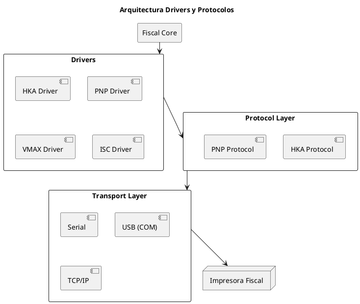
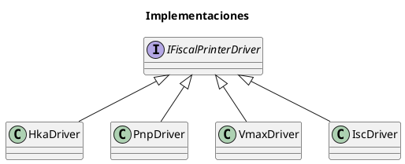
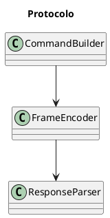
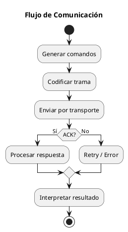

# ARGO FISCAL PRINTER 360 – Diseño de Drivers y Protocolos

**Código:** ARGO-FISCAL-PRINTER-360  
**Documento:** Drivers y Protocolos  
**Versión:** 1.0  
**Estado:** Borrador  

---

## 1. Propósito

Definir el diseño de los drivers fiscales y la capa de protocolos de ARGO FISCAL PRINTER 360, permitiendo comunicación directa con impresoras fiscales sin depender de DLLs de fabricantes.

---

## 2. Principios de Diseño

- Abstracción por contrato
- Implementación por fabricante
- Separación protocolo/transporte
- Soporte dual (Directo / Legacy)
- Extensibilidad

---

## 3. Arquitectura General



---

## 4. Interfaz Base de Driver

```csharp id="2n1zrm"
public interface IFiscalPrinterDriver
{
    PrinterStatus GetStatus();

    FiscalResult PrintInvoice(FiscalDocument document);
    FiscalResult PrintCreditNote(FiscalDocument document);
    FiscalResult PrintDebitNote(FiscalDocument document);

    FiscalResult PrintXReport();
    FiscalResult PrintZReport();

    FiscalResult CashIn(decimal amount);
    FiscalResult CashOut(decimal amount);
}
```

---

## 5. Implementaciones de Drivers



---

## 6. Tipos de Driver

### 6.1 Direct Driver

- Comunicación directa con la impresora
- Uso de protocolo propietario
- Mayor control
- Menor dependencia externa

---

### 6.2 Legacy Driver

- Uso de DLL del fabricante
- Compatibilidad inicial
- Soporte temporal

---

## 7. Protocol Layer

### 7.1 Responsabilidades

- Construcción de comandos
- Codificación de tramas
- Manejo de checksum
- Interpretación de respuestas

---

### 7.2 Estructura de trama (ejemplo HKA)

```text id="e2w3zc"
STX + DATA + ETX + LRC
```

---

### 7.3 Componentes



---

## 8. Transport Layer

### 8.1 Tipos soportados

- Serial (RS232)
- USB (COM virtual)
- TCP/IP

---

### 8.2 Responsabilidades

- Apertura de conexión
- Envío de bytes
- Recepción de respuesta
- Manejo de timeouts

---

## 9. Flujo de Comunicación



---

## 10. Manejo de Errores

- Timeout de comunicación
- NAK recibido
- Error fiscal
- Puerto ocupado
- Impresora apagada

Todos deben:

- registrarse en journal
- devolver estado al Core

---

## 11. Capacidades de Impresora

```csharp id="7r03dv"
public class PrinterCapabilities
{
    public bool SupportsIgtf { get; set; }
    public bool RequiresCommand199 { get; set; }
    public bool SupportsForeignCurrency { get; set; }
    public bool SupportsPartialPayments { get; set; }
}
```

---

## 12. Configuración de Driver

```json id="s6e9aq"
{
  "Driver": "HKA",
  "Port": "COM3",
  "BaudRate": 9600,
  "Timeout": 5000,
  "Mode": "Direct"
}
```

---

## 13. Estrategia de Implementación

- Fase 1: Driver Legacy (DLL)
- Fase 2: Driver Directo HKA
- Fase 3: Driver Directo PNP
- Fase 4: Drivers adicionales

---

## 14. Reglas Clave

- Comunicación secuencial
- Validación de estado antes de operar
- Confirmación obligatoria de cada comando
- No asumir éxito sin respuesta válida

---

## 15. Estado del documento

Borrador inicial – sujeto a validación
