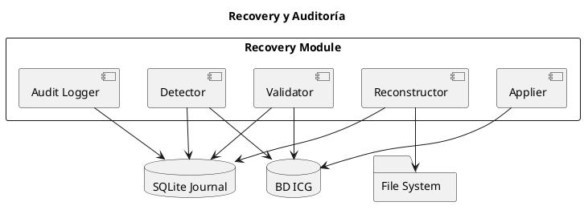
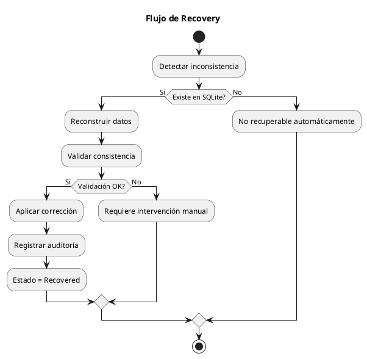

# ARGO FISCAL PRINTER 360 – Recovery y Auditoría

**Código:** ARGO-FISCAL-PRINTER-360  
**Documento:** Recovery y Auditoría  
**Versión:** 1.0  
**Estado:** Borrador  

---

## 1. Propósito

Definir el diseño y funcionamiento del módulo de recuperación y auditoría de ARGO FISCAL PRINTER 360, permitiendo reconstruir, validar y corregir información fiscal ante fallos operativos, errores de configuración o inconsistencias en la BD ICG.

---

## 2. Objetivo

- Evitar pérdida de información fiscal
- Detectar inconsistencias automáticamente
- Permitir reconstrucción confiable
- Garantizar trazabilidad completa
- Soportar auditorías técnicas y fiscales

---

## 3. Arquitectura del Módulo



---

## 4. Detección de Inconsistencias

### 4.1 Tipos detectables

- Documento sin número fiscal
- Documento sin número de control
- IGTF no registrado
- NC sin factura afectada
- Serial de impresora faltante
- Diferencias entre XML y BD ICG

---

### 4.2 Estrategia

- Comparar BD ICG vs SQLite
- Validar consistencia por documento
- Marcar como RecoveryRequired

---

## 5. Reconstrucción de Datos

### 5.1 Fuente de verdad

1. SQLite Journal
2. Archivos del expediente
3. Respuesta de impresora

---

### 5.2 Datos recuperables

- Número fiscal
- Número de control
- Serial impresora
- ZFiscal
- Fecha/hora fiscal
- BASEIGTF / TOTALIGTF
- Factura afectada (NC/ND)

---

## 6. Validación de Recuperación

Antes de aplicar cambios:

- Validar coincidencia de Serie/Numero
- Validar total del documento
- Validar tipo (Factura/NC/ND)
- Validar integridad del hash

---

## 7. Aplicación de Correcciones

### 7.1 Modo automático

- Solo si coincidencia 100%
- Sin ambigüedad

---

### 7.2 Modo asistido

- Requiere intervención técnica
- Presenta datos para confirmación

---

### 7.3 Escritura

- Actualizar campos libres en BD ICG
- No modificar documentos fiscales en impresora

---

## 8. Auditoría

### 8.1 Registro obligatorio

Cada acción de recovery debe registrar:

- Fecha
- Usuario/técnico
- Documento afectado
- Valores anteriores
- Valores nuevos
- Motivo

---

### 8.2 Persistencia

```text
SQLite → tabla TransactionEvents
```

---

## 9. Flujo de Recovery



---

## 10. Reglas de Negocio

- Nunca modificar información fiscal original de impresora
- Toda corrección debe ser auditable
- No aplicar cambios sin validación
- Priorizar seguridad sobre automatización

---

## 11. Integración con Journal

- Estado RecoveryRequired
- Estado Recovered
- Eventos detallados por transacción

---

## 12. Seguridad

- Acceso restringido al módulo
- Registro obligatorio de acciones
- Protección contra manipulación

---

## 13. Casos de Uso

- CU-REC-001: Recuperar factura sin número fiscal
- CU-REC-002: Corregir IGTF faltante
- CU-REC-003: Reconstruir NC con factura afectada
- CU-REC-004: Auditoría de documento fiscal

---

## 14. Estado del documento

Borrador inicial – sujeto a validación
