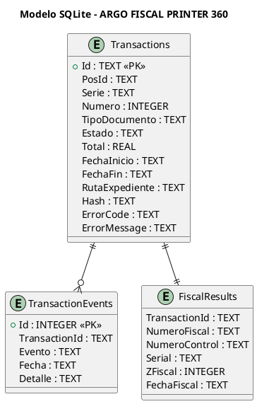
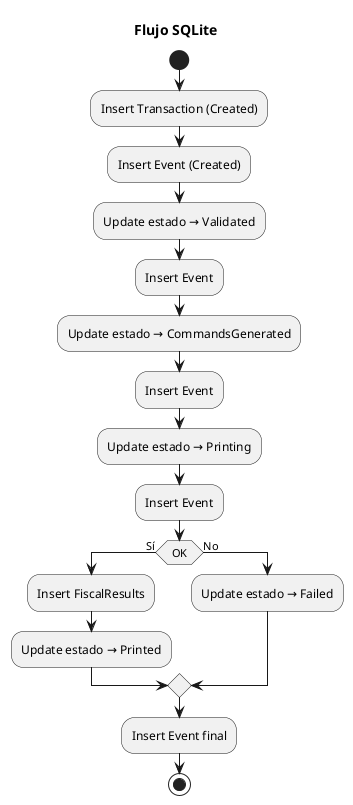

# ARGO FISCAL PRINTER 360 – Diseño de Base de Datos SQLite

**Código:** ARGO-FISCAL-PRINTER-360  
**Documento:** Diseño SQLite  
**Versión:** 1.0  
**Estado:** Borrador  

---

## 1. Propósito

Definir el diseño detallado de la base de datos SQLite utilizada como journal transaccional en ARGO FISCAL PRINTER 360, garantizando trazabilidad, integridad y capacidad de recuperación de operaciones fiscales.

---

## 2. Principios de Diseño

- Persistencia completa de transacciones
- Escritura segura (antes, durante y después)
- No eliminación automática
- Integridad mediante hash
- Optimización para lectura y auditoría

---

## 3. Diagrama de Base de Datos



---

## 4. Tabla: Transactions

### 4.1 Definición

```sql
CREATE TABLE Transactions (
    Id TEXT PRIMARY KEY,
    PosId TEXT NOT NULL,
    Serie TEXT,
    Numero INTEGER,
    TipoDocumento TEXT,
    Estado TEXT NOT NULL,
    Total REAL,
    FechaInicio TEXT NOT NULL,
    FechaFin TEXT,
    RutaExpediente TEXT,
    Hash TEXT,
    ErrorCode TEXT,
    ErrorMessage TEXT
);
```

### 4.2 Descripción

Registro principal de cada transacción fiscal.

---

## 5. Tabla: TransactionEvents

### 5.1 Definición

```sql
CREATE TABLE TransactionEvents (
    Id INTEGER PRIMARY KEY AUTOINCREMENT,
    TransactionId TEXT NOT NULL,
    Evento TEXT NOT NULL,
    Fecha TEXT NOT NULL,
    Detalle TEXT
);
```

### 5.2 Descripción

Bitácora detallada de eventos por transacción.

---

## 6. Tabla: FiscalResults

### 6.1 Definición

```sql
CREATE TABLE FiscalResults (
    TransactionId TEXT PRIMARY KEY,
    NumeroFiscal TEXT,
    NumeroControl TEXT,
    Serial TEXT,
    ZFiscal INTEGER,
    FechaFiscal TEXT
);
```

### 6.2 Descripción

Resultado fiscal retornado por la impresora.

---

## 7. Índices

```sql
CREATE INDEX idx_transactions_pos ON Transactions(PosId);
CREATE INDEX idx_transactions_estado ON Transactions(Estado);
CREATE INDEX idx_transactions_fecha ON Transactions(FechaInicio);
CREATE INDEX idx_events_transaction ON TransactionEvents(TransactionId);
```

---

## 8. Estados de Transacción

- Created
- Validated
- CommandsGenerated
- Printing
- Printed
- Failed
- Cancelled
- RecoveryRequired
- Recovered

---

## 9. Flujo de Persistencia



---

## 10. Integridad

### 10.1 Hash

El campo `Hash` deberá calcularse sobre:

- XML originales
- comandos generados
- respuesta de impresora

Algoritmo recomendado:

```text
SHA-256
```

---

## 11. Reglas de Persistencia

- Toda transacción se inserta antes de imprimir
- Toda transición de estado se registra
- No se elimina información automáticamente
- Los errores se almacenan siempre

---

## 12. Manejo de Fallos

- Si el sistema se interrumpe:
  → estado queda en Printing o Failed
  → Recovery Module debe evaluarlo

---

## 13. Relación con FileSystem

```text
Transactions.RutaExpediente → carpeta física:

/transactions/{Id}/
```

---

## 14. Estrategia de Respaldo

- Copia de fiscal360.db
- Copia de carpeta transactions
- Opcional: compresión por fecha

---

## 15. Consideraciones de Rendimiento

- SQLite en modo WAL (Write-Ahead Logging)
- Transacciones cortas
- Índices en campos de búsqueda

---

## 16. Estado del documento

Borrador inicial – sujeto a validación
