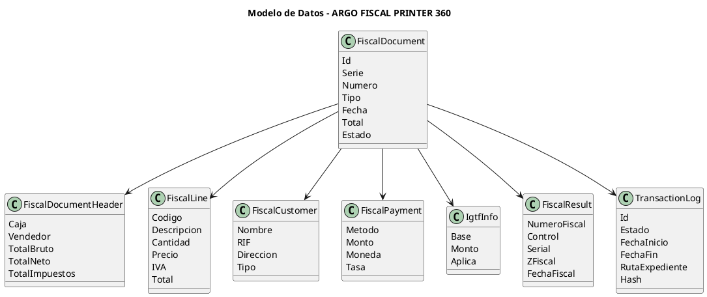

# ARGO FISCAL PRINTER 360 – Modelo de Datos

**Código:** ARGO-FISCAL-PRINTER-360  
**Documento:** Modelo de Datos  
**Versión:** 1.0  
**Estado:** Borrador  

---

## 1. Propósito

Definir el modelo de datos conceptual y lógico de ARGO FISCAL PRINTER 360, incluyendo:

- Representación de documentos fiscales
- Estructura del journal SQLite
- Relación con XML de ICG
- Soporte para trazabilidad y recuperación

---

## 2. Visión General

El modelo de datos se basa en tres fuentes principales:

```text
1. XML de entrada (ICG)
2. Modelo interno (FiscalDocument)
3. Persistencia (SQLite + filesystem)
````

---

## 3. Diagrama de Modelo Conceptual



---

## 4. Modelo de Documento Fiscal

### 4.1 FiscalDocument

- Id
- Serie
- Numero
- TipoDocumento (Factura, NC, ND)
- Fecha
- Estado
- Total

---

### 4.2 Cabecera

- Caja
- Vendedor
- TotalBruto
- TotalNeto
- TotalImpuesto
- Propina

---

### 4.3 Líneas

- CodigoArticulo
- Descripcion
- Cantidad
- Precio
- IVA
- TotalLinea
- TipoImpuesto
- Departamento
- Seccion

---

### 4.4 Cliente

- Nombre
- RIF/CIF
- Direccion
- Telefono
- TipoCliente
- Contribuyente

---

### 4.5 Pagos

- MetodoPago
- Descripcion
- Monto
- Moneda
- TasaCambio

---

### 4.6 IGTF

- BaseIGTF
- MontoIGTF
- AplicaIGTF

---

### 4.7 Resultado Fiscal

- NumeroFiscal
- NumeroControl
- SerialImpresora
- ZFiscal
- FechaFiscal
- HoraFiscal

---

## 5. Modelo SQLite (Journal)

### 5.1 Tabla: Transactions

```sql
CREATE TABLE Transactions (
    Id TEXT PRIMARY KEY,
    PosId TEXT,
    Serie TEXT,
    Numero INTEGER,
    TipoDocumento TEXT,
    Estado TEXT,
    Total REAL,
    FechaInicio TEXT,
    FechaFin TEXT,
    RutaExpediente TEXT,
    Hash TEXT,
    ErrorCode TEXT,
    ErrorMessage TEXT
);
```

---

### 5.2 Tabla: TransactionEvents

```sql
CREATE TABLE TransactionEvents (
    Id INTEGER PRIMARY KEY AUTOINCREMENT,
    TransactionId TEXT,
    Evento TEXT,
    Fecha TEXT,
    Detalle TEXT
);
```

---

### 5.3 Tabla: FiscalResults

```sql
CREATE TABLE FiscalResults (
    TransactionId TEXT,
    NumeroFiscal TEXT,
    NumeroControl TEXT,
    Serial TEXT,
    ZFiscal INTEGER,
    FechaFiscal TEXT
);
```

---

## 6. Relación con XML ICG

| XML             | Modelo Interno       |
| --------------- | -------------------- |
| pCab.xml        | FiscalDocumentHeader |
| pLineas.xml     | FiscalLine           |
| pCliente.xml    | FiscalCustomer       |
| pFormasPago.xml | FiscalPayment        |

---

## 7. Expediente de Transacción

Cada transacción genera:

```bash
/transactions/{TransactionId}/
    pCab.xml
    pLineas.xml
    pCliente.xml
    pFormasPago.xml
    pcmd_printer.txt
    printer_response.txt
    execution.log
```

---

## 8. Estados de Transacción

- Created
- Validated
- CommandsGenerated
- Printing
- Printed
- Failed
- Cancelled
- RecoveryRequired
- Recovered

---

## 9. Reglas de Integridad

- Toda transacción debe tener Id único
- No se permite eliminación automática
- Hash obligatorio para integridad
- Escritura antes y después de imprimir

---

## 10. Reglas de Persistencia

- SQLite es fuente de trazabilidad
- FileSystem es fuente de evidencia
- BD ICG es fuente operativa del POS

---

## 11. Estado del documento

Borrador inicial – sujeto a validación
