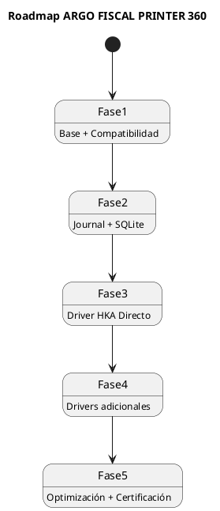

# ARGO FISCAL PRINTER 360 – Roadmap Técnico

**Código:** ARGO-FISCAL-PRINTER-360  
**Documento:** Roadmap Técnico  
**Versión:** 1.0  
**Estado:** Borrador  

---

## 1. Propósito

Definir el plan de implementación de ARGO FISCAL PRINTER 360, estableciendo fases, prioridades y entregables para construir un sistema robusto, compatible y certificable con ICG.

---

## 2. Estrategia General

- Construcción incremental
- Validación continua
- Compatibilidad primero
- Control de riesgo por fases
- Sustitución progresiva de DLLs

---

## 3. Diagrama de Fases

---

## 4. Fase 1 – Base y Compatibilidad

### Objetivo

Reproducir comportamiento actual del sistema VB6

### Alcance

- ICG Bridge (DLL)
- Parsing XML
- Modelo de datos básico
- Wrapper DLL existente (tfhkaif / PNP)
- Flujo completo Venta/NC/Z

### Entregables

✔ DLL compatible con ICG
✔ Flujo funcional completo
✔ Pruebas básicas

---

## 5. Fase 2 – Journal y Trazabilidad

### Objetivo

Implementar persistencia completa

### Alcance

- SQLite
- Transaction Manager
- File System (expedientes)
- Hash de integridad

### Entregables

✔ Registro completo de transacciones
✔ Soporte de auditoría
✔ Base para recovery

---

## 6. Fase 3 – Driver Directo HKA

### Objetivo

Eliminar dependencia de DLL HKA

### Alcance

- Protocol Layer HKA
- Transport Serial
- Command Builder
- Parser de respuestas

### Entregables

✔ Driver HKA Directo
✔ Validación con impresora real
✔ Soporte IGTF completo

---

## 7. Fase 4 – Drivers adicionales

### Objetivo

Soporte multi-fabricante

### Alcance

- Driver PNP
- Driver VMAX
- Driver ISC

### Entregables

✔ Drivers por fabricante
✔ Capabilities por modelo
✔ Testing cruzado

---

## 8. Fase 5 – Optimización y Certificación

### Objetivo

Preparar producto final

### Alcance

- Optimización de rendimiento
- Validación completa ICG
- Testing de campo
- Hardening

### Entregables

✔ Producto estable
✔ Listo para certificación
✔ Documentación final

---

## 9. Riesgos y Mitigación

R1: Diferencias XML ICG
→ Mitigación: Compliance Layer

R2: Protocolos incompletos
→ Mitigación: uso temporal DLL

R3: Errores en campo
→ Mitigación: Journal + Recovery

R4: IGTF mal implementado
→ Mitigación: pruebas específicas

R5: Inconsistencia BD ICG
→ Mitigación: módulo recovery

---

## 10. Prioridades Técnicas

1. Compatibilidad ICG
2. Integridad de datos
3. Comunicación con impresora
4. Trazabilidad
5. Performance

---

## 11. Métricas de Progreso

- % de casos ICG soportados
- % de drivers implementados
- tasa de errores en pruebas
- tiempo de ejecución

---

## 12. Estrategia de Despliegue

- Instalación por POS
- Configuración individual
- Migración progresiva

---

## 13. Evolución futura

- Soporte multi-POS (no fiscal)
- Integración con otros POS
- Reportes centralizados
- Monitoreo remoto

---

## 14. Estado del documento

Borrador inicial – sujeto a validación
