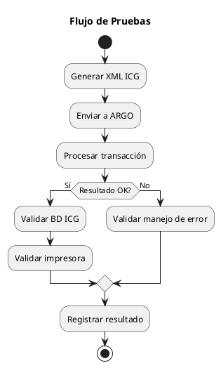

# ARGO FISCAL PRINTER 360 – Plan de Pruebas y Certificación ICG

**Código:** ARGO-FISCAL-PRINTER-360  
**Documento:** Plan de Pruebas  
**Versión:** 1.0  
**Estado:** Borrador  

---

## 1. Propósito

Definir el plan de pruebas para validar el correcto funcionamiento de ARGO FISCAL PRINTER 360 y asegurar compatibilidad total con productos ICG, incluyendo escenarios fiscales reales requeridos para certificación.

---

## 2. Objetivos

- Validar cumplimiento funcional
- Validar cumplimiento fiscal (SENIAT/IGTF)
- Garantizar compatibilidad con ICG
- Detectar errores en escenarios reales
- Asegurar estabilidad en producción

---

## 3. Alcance

Incluye pruebas para:

- FrontRetail
- FrontRest
- FrontHotel
- Manager

Y fabricantes:

- HKA
- PNP
- VMAX
- ISC

---

## 4. Tipos de Pruebas

- TP-UNIT   → Unitarias
- TP-INT    → Integración
- TP-FUNC   → Funcionales
- TP-FISC   → Fiscales
- TP-ERR    → Manejo de errores
- TP-REC    → Recovery
- TP-PERF   → Rendimiento

---

## 5. Entorno de Pruebas

- Windows 10/11
- Base de datos ICG (test)
- Impresoras fiscales reales
- Simulador (Mock Driver)

---

## 6. Diagrama de Flujo de Pruebas

---

## 7. Escenarios Funcionales

### 7.1 Venta básica

Entrada: XML factura simple
Esperado:

- Impresión correcta
- Registro en BD ICG
- Registro en SQLite

---

### 7.2 Venta con múltiples pagos

- Efectivo + Tarjeta
- Validar distribución correcta

---

### 7.3 Venta con divisas (IGTF)

- Pago en USD
- Validar BASEIGTF
- Validar TOTALIGTF
- Validar cierre fiscal correcto

---

### 7.4 Nota de crédito

- Validar factura afectada
- Validar registro en BD ICG

---

### 7.5 Reporte X/Z

- Validar ejecución correcta
- Validar respuesta de impresora

---

### 7.6 Documento no fiscal

- Validar impresión sin impacto fiscal

---

## 8. Escenarios de Error

- Impresora apagada
- Puerto ocupado
- Papel agotado
- Documento abierto
- Timeout de comunicación

Esperado:

- Error controlado
- Registro en journal
- No corrupción de datos

---

## 9. Escenarios de Recovery

- Falta número fiscal en BD ICG
- Falta control fiscal
- IGTF no guardado

Esperado:

- Detección automática
- Reconstrucción desde SQLite
- Aplicación correcta

---

## 10. Casos de Prueba (ejemplo)

### TC-001 – Venta básica

Input: pCab.xml + pLineas.xml
Output esperado:
- Estado = Printed
- NumeroFiscal generado
- BD ICG actualizada

---

### TC-002 – Error de impresora

Input: impresora desconectada
Output esperado:
- Estado = Failed
- Error registrado
- No modificación en BD ICG

---

### TC-003 – Recovery

Input: documento sin número fiscal
Output esperado:
- Estado = Recovered
- BD ICG corregida

---

## 11. Criterios de Aceptación

- 100% de casos críticos exitosos
- 0 pérdida de información
- Trazabilidad completa
- Compatibilidad total con XML ICG

---

## 12. Estrategia de Certificación ICG

1. Validar comportamiento idéntico al sistema actual
2. Ejecutar pruebas con ICG
3. Validar escenarios edge
4. Validación en entorno real

---

## 13. Automatización

- Tests unitarios
- Mock de impresora
- Simulación de XML

---

## 14. Estado del documento

Borrador inicial – sujeto a validación
