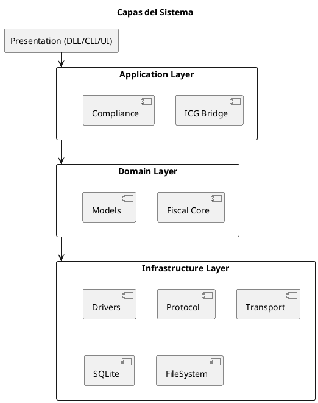
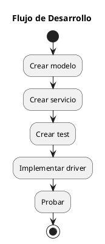

# ARGO FISCAL PRINTER 360 – Guía de Desarrollo

**Código:** ARGO-FISCAL-PRINTER-360  
**Documento:** Guía de Desarrollo  
**Versión:** 1.0  
**Estado:** Borrador  

---

## 1. Propósito

Definir la estructura de código, estándares de desarrollo y organización de proyectos para ARGO FISCAL PRINTER 360, garantizando mantenibilidad, extensibilidad y claridad arquitectónica.

---

## 2. Stack Tecnológico

Lenguaje: C#
Framework: .NET 8 LTS
UI (opcional): Avalonia
Base de datos: SQLite
Comunicación: Serial / TCP

---

## 3. Estructura de Solución

```bash
ARGO.Fiscal360.sln

/ src
  / ARGO.Fiscal360.Core
  / ARGO.Fiscal360.Domain
  / ARGO.Fiscal360.IcgBridge
  / ARGO.Fiscal360.IcgCompliance
  / ARGO.Fiscal360.IcgDatabase

  / ARGO.Fiscal360.Driver.HKA
  / ARGO.Fiscal360.Driver.PNP
  / ARGO.Fiscal360.Driver.VMAX
  / ARGO.Fiscal360.Driver.ISC

  / ARGO.Fiscal360.Protocol
  / ARGO.Fiscal360.Transport

  / ARGO.Fiscal360.Journal
  / ARGO.Fiscal360.Recovery
  / ARGO.Fiscal360.Config

  / ARGO.Fiscal360.Mock

/ tests
  / ARGO.Fiscal360.Tests.Unit
  / ARGO.Fiscal360.Tests.Integration
```

---

## 4. Diagrama de Capas



---

## 5. Convenciones de Código

### 5.1 Naming

- Clases: PascalCase
- Métodos: PascalCase
- Variables: camelCase
- Interfaces: IFiscalPrinterDriver

---

### 5.2 Estructura de clases

```csharp
public class FiscalDocument
{
    public string Serie { get; set; }
    public int Numero { get; set; }
    public decimal Total { get; set; }
}
```

---

### 5.3 Interfaces

```csharp
public interface IFiscalPrinterDriver
{
    FiscalResult PrintInvoice(FiscalDocument document);
}
```

---

## 6. Principios de Desarrollo

- SOLID
- Inyección de dependencias
- Bajo acoplamiento
- Alta cohesión

---

## 7. Manejo de Dependencias

- Usar DI container
- No instanciar drivers directamente
- Resolver por configuración

---

## 8. Manejo de Errores

- No usar excepciones para control normal
- Log obligatorio de errores
- Retornar resultados estructurados

---

## 9. Logging

- Log por transacción
- Niveles: Info, Warning, Error
- Integración con Journal

---

## 10. Configuración

Archivo:

```json
{
  "PosId": "POS01",
  "Driver": "HKA",
  "Port": "COM3",
  "Database": {
    "Server": "localhost",
    "Name": "ICG_DB"
  }
}
```

---

## 11. Testing

- Unit tests para lógica
- Integration tests para drivers
- Mock para impresoras

---

## 12. Flujo de Desarrollo



---

## 13. Reglas Clave

- Nunca acceder a impresora desde el Core directamente
- Todo pasa por Driver
- Todo XML pasa por Compliance Layer
- Toda operación se registra en Journal

---

## 14. Buenas Prácticas

- Mantener métodos pequeños
- Evitar lógica en controladores
- Documentar código crítico

---

## 15. Estado del documento

Borrador inicial – sujeto a validación
