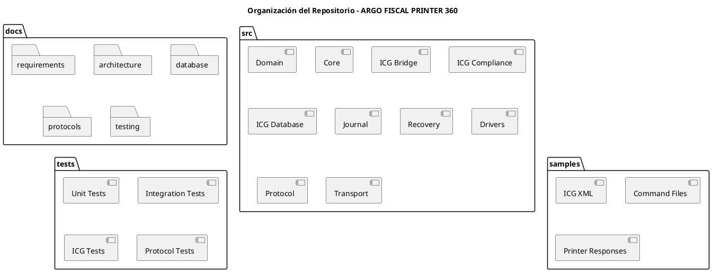
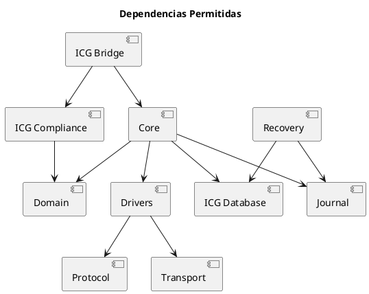

Perfecto. Seguimos con la plantilla base del proyecto.

# ARGO FISCAL PRINTER 360 – Estructura Inicial del Proyecto

**Código:** ARGO-FISCAL-PRINTER-360  
**Documento:** Estructura Inicial del Proyecto  
**Versión:** 1.0  
**Estado:** Borrador  

---

## 1. Propósito

Definir la estructura inicial de repositorio, solución, proyectos, carpetas y responsabilidades para iniciar el desarrollo de ARGO FISCAL PRINTER 360 de forma ordenada, modular y mantenible.

---

## 2. Nombre del Repositorio

argo-fiscal-360

---

## 3. Descripción corta del repositorio

Plataforma de integración fiscal para productos ICG en Venezuela, con trazabilidad transaccional, soporte multi-fabricante y cumplimiento SENIAT/IGTF.

---

## 4. Estructura General

```text
argo-fiscal-360/
│
├── docs/
│   ├── requirements/
│   ├── architecture/
│   ├── database/
│   ├── protocols/
│   ├── testing/
│   └── diagrams/
│
├── src/
│   ├── ARGO.Fiscal360.Domain/
│   ├── ARGO.Fiscal360.Core/
│   ├── ARGO.Fiscal360.IcgBridge/
│   ├── ARGO.Fiscal360.IcgCompliance/
│   ├── ARGO.Fiscal360.IcgDatabase/
│   ├── ARGO.Fiscal360.Journal/
│   ├── ARGO.Fiscal360.Recovery/
│   ├── ARGO.Fiscal360.Config/
│   ├── ARGO.Fiscal360.Protocol/
│   ├── ARGO.Fiscal360.Transport/
│   ├── ARGO.Fiscal360.Driver.HKA/
│   ├── ARGO.Fiscal360.Driver.PNP/
│   ├── ARGO.Fiscal360.Driver.VMAX/
│   ├── ARGO.Fiscal360.Driver.ISC/
│   └── ARGO.Fiscal360.Mock/
│
├── tests/
│   ├── ARGO.Fiscal360.Tests.Unit/
│   ├── ARGO.Fiscal360.Tests.Integration/
│   ├── ARGO.Fiscal360.Tests.ICG/
│   └── ARGO.Fiscal360.Tests.Protocol/
│
├── samples/
│   ├── icg-xml/
│   ├── command-files/
│   └── printer-responses/
│
├── tools/
│   ├── db/
│   ├── diagnostics/
│   └── migration/
│
├── build/
│
├── README.md
├── CHANGELOG.md
├── LICENSE.md
├── .gitignore
└── ARGO.Fiscal360.sln
```

---

## 5. Diagrama de Organización



---

## 6. Proyectos Principales

### 6.1 ARGO.Fiscal360.Domain

Contiene el modelo de dominio puro.

Responsabilidades:

- FiscalDocument
- FiscalLine
- FiscalCustomer
- FiscalPayment
- FiscalResult
- PrinterStatus
- IgtfInfo

No debe depender de infraestructura.

---

### 6.2 ARGO.Fiscal360.Core

Contiene la lógica central de orquestación fiscal.

Responsabilidades:

- Procesar documentos
- Coordinar drivers
- Validar reglas fiscales
- Coordinar Journal
- Coordinar BD ICG

---

### 6.3 ARGO.Fiscal360.IcgBridge

Expone el contrato esperado por ICG.

Responsabilidades:

- Funciones DLL exportadas
- Entrada/salida compatible con ICG
- Manejo de pInfoSalida
- Compatibilidad con Venta(), ReporteX(), ReporteZ(), etc.

---

### 6.4 ARGO.Fiscal360.IcgCompliance

Normaliza las diferencias entre productos ICG.

Responsabilidades:

- RetailProfile
- RestProfile
- HotelProfile
- ManagerProfile
- Validación XML
- Mapeo a FiscalDocument

---

### 6.5 ARGO.Fiscal360.IcgDatabase

Gestiona lectura/escritura contra la base de datos ICG.

Responsabilidades:

- Campos libres
- Factura afectada
- Número fiscal
- Número de control
- IGTF
- Serial fiscal

---

### 6.6 ARGO.Fiscal360.Journal

Gestiona SQLite y expedientes transaccionales.

Responsabilidades:

- Transactions
- TransactionEvents
- FiscalResults
- Hash
- Estado de transacción

---

### 6.7 ARGO.Fiscal360.Recovery

Gestiona reconstrucción y corrección auditada.

Responsabilidades:

- Detectar inconsistencias
- Reconstruir datos
- Aplicar correcciones
- Registrar auditoría

---

### 6.8 ARGO.Fiscal360.Protocol

Contiene codificación y decodificación de protocolos.

Responsabilidades:

- FrameEncoder
- LRC / checksum
- ResponseParser
- CommandBuilder base

---

### 6.9 ARGO.Fiscal360.Transport

Contiene comunicación física/lógica.

Responsabilidades:

- SerialTransport
- TcpTransport
- UsbComTransport
- Timeouts
- Retries

---

### 6.10 Drivers

Cada fabricante debe tener su proyecto independiente:

- ARGO.Fiscal360.Driver.HKA
- ARGO.Fiscal360.Driver.PNP
- ARGO.Fiscal360.Driver.VMAX
- ARGO.Fiscal360.Driver.ISC

Cada driver implementa:

- IFiscalPrinterDriver

---

## 7. Dependencias Permitidas



---

## 8. Reglas de Dependencia

- Domain no depende de ningún proyecto
- Core no accede directamente a XML
- Core no accede directamente a puertos COM
- Drivers no acceden a BD ICG
- IcgBridge no implementa lógica fiscal
- Journal no conoce reglas fiscales
- Recovery no modifica sin auditoría

---

## 9. Convención de Branches

```text
main
develop
feature/*
fix/*
release/*
hotfix/*
```

---

## 10. Convención de Versionado

```text
MAJOR.MINOR.PATCH
```

Ejemplo:

```text
1.0.0
1.1.0
1.1.1
```

---

## 11. Primeros Entregables Técnicos

1. Crear solución .NET
2. Crear proyectos base
3. Crear modelos de dominio
4. Crear parser XML ICG inicial
5. Crear Journal SQLite inicial
6. Crear driver mock
7. Crear flujo Venta end-to-end con mock

---

## 12. Estado del documento

Borrador inicial – sujeto a validación
