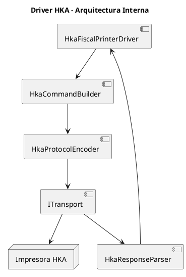
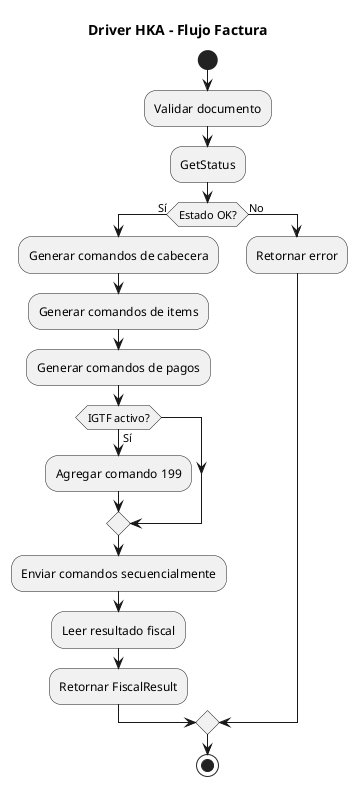

# ARGO FISCAL PRINTER 360 – Esqueleto del Driver HKA

**Código:** ARGO-FISCAL-PRINTER-360  
**Documento:** Driver HKA  
**Versión:** 1.0  
**Estado:** Borrador  

---

## 1. Propósito

Definir el diseño inicial del driver HKA para ARGO FISCAL PRINTER 360, encargado de convertir operaciones fiscales del modelo interno en comandos compatibles con impresoras fiscales HKA utilizadas en Venezuela.

---

## 2. Alcance

El driver HKA deberá soportar inicialmente:

- Factura fiscal
- Nota de crédito
- Nota de débito
- Documento no fiscal
- Reporte X
- Reporte Z
- CashIn
- CashOut
- Estado de impresora
- IGTF

---

## 3. Modelos Iniciales Soportados

- HKA80
- SRP812
- DT230
- PP9PLUS
- DT1140
- P3100DL

---

## 4. Dependencias

- ARGO.Fiscal360.Domain
- ARGO.Fiscal360.Protocol
- ARGO.Fiscal360.Transport

El driver no debe depender de:

- ICG Bridge
- ICG Compliance
- ICG Database
- Journal

---

## 5. Interfaz Implementada

```csharp
public sealed class HkaFiscalPrinterDriver : IFiscalPrinterDriver
{
    public PrinterStatus GetStatus();

    public FiscalResult PrintInvoice(FiscalDocument document);
    public FiscalResult PrintCreditNote(FiscalDocument document);
    public FiscalResult PrintDebitNote(FiscalDocument document);

    public FiscalResult PrintNonFiscalDocument(NonFiscalDocument document);

    public FiscalResult PrintXReport();
    public FiscalResult PrintZReport();

    public FiscalResult CashIn(decimal amount);
    public FiscalResult CashOut(decimal amount);
}
```

---

## 6. Arquitectura Interna



---

## 7. Componentes

### 7.1 HkaFiscalPrinterDriver

Responsable de orquestar operaciones fiscales de alto nivel.

```text
FiscalDocument → comandos HKA → resultado fiscal
```

---

### 7.2 HkaCommandBuilder

Responsable de generar comandos HKA desde el modelo fiscal.

Ejemplos:

- Comando de apertura de factura
- Comando de ítem
- Comando de pago
- Comando 199 para cierre IGTF
- Reporte X
- Reporte Z

---

### 7.3 HkaProtocolEncoder

Responsable de construir la trama:

```text
STX + DATA + ETX + LRC
```

---

### 7.4 HkaResponseParser

Responsable de interpretar:

- ACK
- NAK
- Status
- Errores
- Resultados fiscales

---

### 7.5 Transport

Responsable de:

- Abrir puerto
- Enviar bytes
- Leer respuesta
- Manejar timeout

---

## 8. Capacidades HKA

```csharp
public sealed class HkaPrinterCapabilities : PrinterCapabilities
{
    public HkaPrinterCapabilities()
    {
        SupportsIgtf = true;
        RequiresCommand199 = true;
        SupportsForeignCurrency = true;
        SupportsPartialPayments = true;
    }
}
```

---

## 9. Configuración del Driver

```json
{
  "Driver": "HKA",
  "Mode": "Direct",
  "Model": "HKA80",
  "Port": "COM3",
  "BaudRate": 9600,
  "Parity": "Even",
  "DataBits": 8,
  "StopBits": 1,
  "TimeoutMs": 5000,
  "RetryCount": 3,
  "Igtf": {
    "Enabled": true,
    "Flag50": true,
    "Flag63": 17,
    "RequiresCommand199": true
  }
}
```

---

## 10. Flujo de Factura



---

## 11. Manejo IGTF

El driver deberá:

- Detectar pagos en divisas
- Validar flag 50
- Mapear medios de pago 20–24
- Ejecutar comando 199 cuando aplique
- Obtener valores IGTF generados por la impresora

---

## 12. Manejo de Errores

Errores mínimos:

- HKA-ERR-001: Puerto no disponible
- HKA-ERR-002: Timeout
- HKA-ERR-003: NAK recibido
- HKA-ERR-004: Estado fiscal inválido
- HKA-ERR-005: Error de papel
- HKA-ERR-006: Error fiscal
- HKA-ERR-007: Documento abierto
- HKA-ERR-008: IGTF no habilitado

---

## 13. Estados Esperados

- Ready
- Busy
- FiscalDocumentOpen
- NonFiscalDocumentOpen
- PaperOut
- FiscalError
- Unknown

---

## 14. Pruebas Iniciales

- TC-HKA-001: Obtener estado
- TC-HKA-002: Reporte X
- TC-HKA-003: Reporte Z
- TC-HKA-004: Factura simple
- TC-HKA-005: Factura con IGTF
- TC-HKA-006: Nota de crédito
- TC-HKA-007: Timeout
- TC-HKA-008: Papel agotado

---

## 15. Reglas de Diseño

- El driver no conoce XML ICG
- El driver no escribe BD ICG
- El driver no escribe SQLite directamente
- El driver solo retorna resultados estructurados
- El driver nunca asume éxito sin ACK/respuesta válida

---

## 16. Estado del documento

Borrador inicial – sujeto a validación
