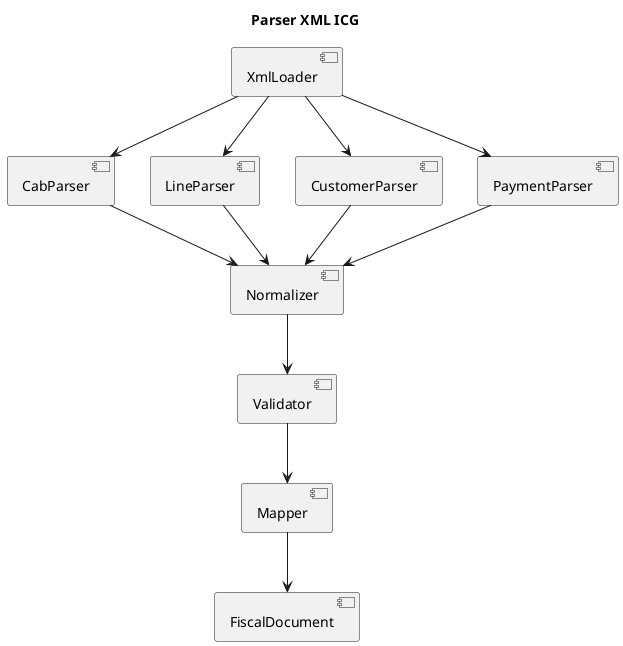
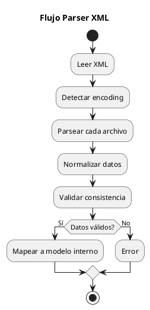
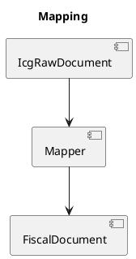

# ARGO FISCAL PRINTER 360 – Parser XML ICG

**Código:** ARGO-FISCAL-PRINTER-360  
**Documento:** Parser XML ICG  
**Versión:** 1.0  
**Estado:** Borrador  

---

## 1. Propósito

Definir el diseño del parser XML encargado de transformar los archivos generados por ICG en estructuras internas utilizadas por ARGO FISCAL PRINTER 360.

---

## 2. Archivos XML Soportados

```text
pCab.xml         → Cabecera del documento
pLineas.xml      → Líneas del documento
pCliente.xml     → Datos del cliente
pFormasPago.xml  → Formas de pago
pExportInfo.xml  → Información adicional (opcional)
````

---

## 3. Arquitectura



---

## 4. Flujo de Procesamiento



---

## 5. Componentes

### 5.1 XmlLoader

Responsable de:

- Leer archivos desde disco
- Manejar encoding (UTF-8, ANSI)
- Validar existencia de archivos

---

### 5.2 CabParser

Extrae:

- Serie
- Número
- Fecha
- Totales
- Tipo documento
- Información fiscal básica

---

### 5.3 LineParser

Extrae:

- Código artículo
- Descripción
- Cantidad
- Precio
- IVA
- Total línea

---

### 5.4 CustomerParser

Extrae:

- Nombre
- RIF/CIF
- Dirección
- Tipo de cliente

---

### 5.5 PaymentParser

Extrae:

- Método de pago
- Monto
- Moneda
- Tasa de cambio

---

## 6. Modelo Intermedio

Antes del modelo final, se recomienda un modelo intermedio:

```csharp
public class IcgRawDocument
{
    public Dictionary<string, string> Header;
    public List<Dictionary<string, string>> Lines;
    public Dictionary<string, string> Customer;
    public List<Dictionary<string, string>> Payments;
}
```

Esto permite:

- Flexibilidad ante cambios XML
- Manejo de diferencias entre productos ICG

---

## 7. Normalización

### Problemas comunes:

- SERIE vs SERIEFAC
- NUMERO vs NUMFACTURA
- RIF vacío
- Campos opcionales faltantes

### Solución:

- Diccionario de equivalencias
- Valores por defecto controlados
- Limpieza de datos

---

## 8. Validaciones

- Total cabecera = suma de líneas
- Total pagos = total documento
- Cantidades > 0
- Precios válidos
- Cliente válido según tipo

---

## 9. Mapeo a Modelo Interno



---

## 10. Manejo IGTF

El parser deberá detectar:

- Pagos en divisa
- Moneda ≠ local
- Base imponible IGTF

Y generar:

```csharp
IgtfInfo
{
    Base,
    Monto,
    Aplica
}
```

---

## 11. Manejo de NC/ND

- Detectar documento afectado
- Validar existencia
- Preparar referencia fiscal

---

## 12. Manejo de Errores

- XML-ERR-001: Archivo no encontrado
- XML-ERR-002: XML inválido
- XML-ERR-003: Campo obligatorio faltante
- XML-ERR-004: Totales inconsistentes
- XML-ERR-005: Pagos inconsistentes

---

## 13. Ejemplo de Código

```csharp
public FiscalDocument Parse(string path)
{
    var raw = LoadRaw(path);

    Normalize(raw);
    Validate(raw);

    return MapToFiscalDocument(raw);
}
```

---

## 14. Reglas Clave

- Nunca confiar en XML sin validar
- No mapear directo a modelo final
- Siempre normalizar primero
- Manejar diferencias por perfil ICG

---

## 15. Casos Edge

- XML incompleto
- Cliente sin RIF
- Pagos inconsistentes
- Campos duplicados
- Encoding incorrecto

---

## 16. Pruebas

- TC-XML-001: XML válido Retail
- TC-XML-002: XML válido Rest
- TC-XML-003: XML incompleto
- TC-XML-004: Totales inconsistentes
- TC-XML-005: Pagos incorrectos

---

## 17. Estado del documento

Borrador inicial – sujeto a validación
