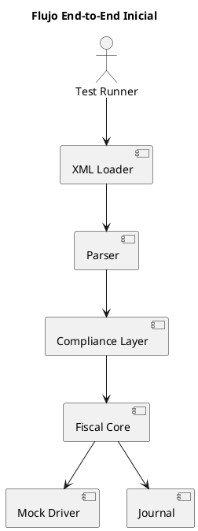
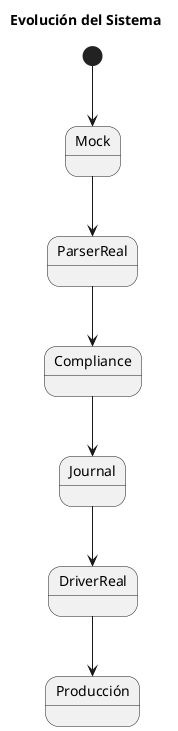

# ARGO FISCAL PRINTER 360 – Bootstrap y Flujo Inicial

**Código:** ARGO-FISCAL-PRINTER-360  
**Documento:** Bootstrap  
**Versión:** 1.0  
**Estado:** Borrador  

---

## 1. Propósito

Definir el proceso para inicializar el proyecto ARGO FISCAL PRINTER 360 desde cero y ejecutar el primer flujo funcional completo:

```text
XML ICG → Parser → Compliance → Core → Driver (Mock) → Resultado
```

---

## 2. Objetivo

- Validar arquitectura
- Verificar integración entre módulos
- Tener un flujo funcional mínimo
- Preparar base para desarrollo incremental

---

## 3. Diagrama del Flujo Inicial



---

## 4. Requisitos Previos

- .NET 8 SDK instalado
- Editor (VS Code / Rider / Visual Studio)
- Repositorio clonado

---

## 5. Creación de la Solución

```bash
dotnet new sln -n ARGO.Fiscal360
```

---

## 6. Creación de Proyectos Base

```bash
dotnet new classlib -n ARGO.Fiscal360.Domain
dotnet new classlib -n ARGO.Fiscal360.Core
dotnet new classlib -n ARGO.Fiscal360.IcgCompliance
dotnet new classlib -n ARGO.Fiscal360.Protocol
dotnet new classlib -n ARGO.Fiscal360.Transport
dotnet new classlib -n ARGO.Fiscal360.Driver.Mock
dotnet new classlib -n ARGO.Fiscal360.Journal
dotnet new console -n ARGO.Fiscal360.Bootstrap
```

---

## 7. Agregar a la solución

```bash
dotnet sln add src/**/*.csproj
```

---

## 8. Modelo mínimo (Domain)

```csharp
public class FiscalDocument
{
    public string Serie { get; set; }
    public int Numero { get; set; }
    public decimal Total { get; set; }
}
```

---

## 9. Driver Mock

```csharp
public class MockFiscalPrinterDriver : IFiscalPrinterDriver
{
    public FiscalResult PrintInvoice(FiscalDocument document)
    {
        return new FiscalResult
        {
            NumeroFiscal = "12345",
            NumeroControl = "A-000123",
            Serial = "MOCK123",
            ZFiscal = 99
        };
    }
}
```

---

## 10. Core mínimo

```csharp
public class FiscalService
{
    private readonly IFiscalPrinterDriver _driver;

    public FiscalService(IFiscalPrinterDriver driver)
    {
        _driver = driver;
    }

    public FiscalResult Process(FiscalDocument doc)
    {
        return _driver.PrintInvoice(doc);
    }
}
```

---

## 11. Parser mínimo

```csharp
public class XmlParser
{
    public FiscalDocument Parse(string path)
    {
        return new FiscalDocument
        {
            Serie = "A",
            Numero = 1,
            Total = 100
        };
    }
}
```

---

## 12. Bootstrap (Console App)

```csharp
var parser = new XmlParser();
var driver = new MockFiscalPrinterDriver();
var service = new FiscalService(driver);

var doc = parser.Parse("samples/pCab.xml");

var result = service.Process(doc);

Console.WriteLine($"Factura fiscal: {result.NumeroFiscal}");
```

---

## 13. Resultado esperado

```text
Factura fiscal: 12345
```

---

## 14. Validaciones del Bootstrap

✔ Parser funciona
✔ Core funciona
✔ Driver responde
✔ Flujo completo ejecuta

---

## 15. Próximos pasos después del bootstrap

1. Reemplazar parser mock por parser real XML
2. Implementar Compliance Layer real
3. Integrar SQLite (Journal)
4. Reemplazar Mock Driver por HKA Driver

---

## 16. Reglas clave

- No integrar todo a la vez
- Validar flujo mínimo primero
- Agregar complejidad progresivamente
- Mantener el sistema siempre ejecutable

---

## 17. Estrategia de crecimiento



---

## 18. Estado del documento

Borrador inicial – sujeto a validación
